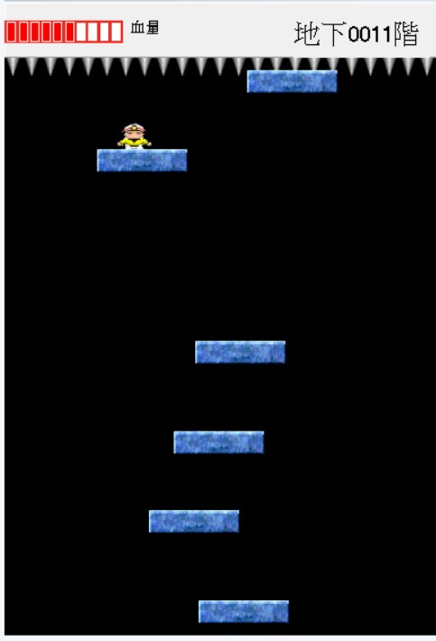

# 小朋友下樓梯
git

本遊戲是使用 **Borland C++ Builder (BCB)** 開發的 **小朋友下樓梯** 遊戲，主要以簡單易懂的操作和有趣的挑戰為核心設計。玩家需控制角色在不斷下降的樓梯間移動，避開障礙物並保持穩定的節奏，以獲得高分。

## 主要特色

- **流暢的角色控制**：使用鍵盤或滑鼠操作角色左右移動，確保順利下降。
- **隨機樓梯生成**：每次遊戲的樓梯排列皆不同，增加遊玩樂趣與挑戰性。

本遊戲適合所有年齡層的玩家，能夠鍛煉反應能力並帶來輕鬆的休閒體驗。